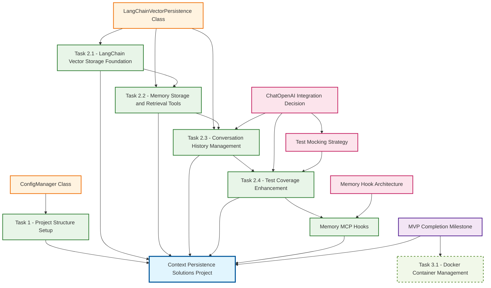
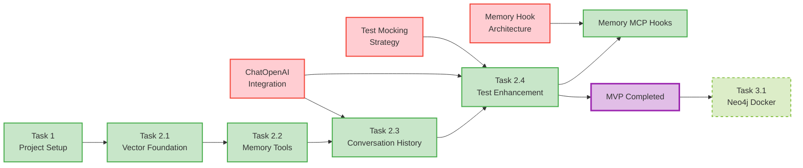
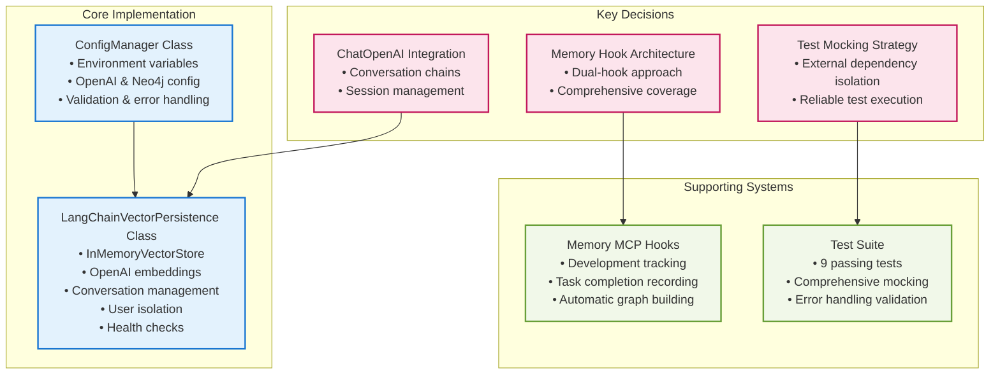
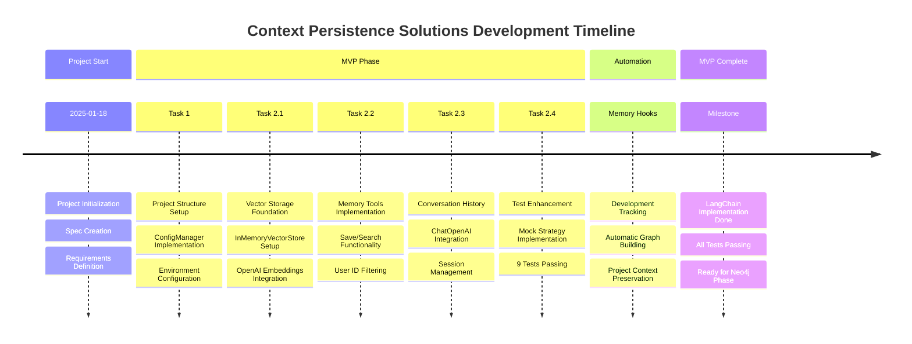

# Context Persistence Solutions - Memory Graph Visualization

## Project Overview Graph

```mermaid
graph TD
    %% Project and Milestone
    Project[Context Persistence Solutions Project]
    MVP[MVP Completion Milestone]
    
    %% Completed Tasks
    T1[Task 1 - Project Structure Setup]
    T21[Task 2.1 - LangChain Vector Storage Foundation]
    T22[Task 2.2 - Memory Storage and Retrieval Tools]
    T23[Task 2.3 - Conversation History Management]
    T24[Task 2.4 - Test Coverage Enhancement]
    Hooks[Memory MCP Hooks]
    
    %% Implementations
    Config[ConfigManager Class]
    LangChain[LangChainVectorPersistence Class]
    
    %% Technical Decisions
    ChatDecision[ChatOpenAI Integration Decision]
    TestStrategy[Test Mocking Strategy]
    HookArch[Memory Hook Architecture]
    
    %% Future Task
    T31[Task 3.1 - Docker Container Management]
    
    %% Relationships
    T1 --> Project
    T21 --> Project
    T22 --> Project
    T23 --> Project
    T24 --> Project
    Hooks --> Project
    MVP --> Project
    
    Config --> T1
    LangChain --> T21
    LangChain --> T22
    LangChain --> T23
    
    T21 --> T22
    T22 --> T23
    T23 --> T24
    T24 --> Hooks
    
    ChatDecision --> T23
    ChatDecision --> T24
    TestStrategy --> T24
    HookArch --> Hooks
    ChatDecision --> TestStrategy
    
    MVP --> T31
    
    %% Styling
    classDef project fill:#e1f5fe,stroke:#01579b,stroke-width:3px
    classDef milestone fill:#f3e5f5,stroke:#4a148c,stroke-width:2px
    classDef completed fill:#e8f5e8,stroke:#2e7d32,stroke-width:2px
    classDef implementation fill:#fff3e0,stroke:#ef6c00,stroke-width:2px
    classDef decision fill:#fce4ec,stroke:#c2185b,stroke-width:2px
    classDef future fill:#f1f8e9,stroke:#558b2f,stroke-width:2px,stroke-dasharray: 5 5
    
    class Project project
    class MVP milestone
    class T1,T21,T22,T23,T24,Hooks completed
    class Config,LangChain implementation
    class ChatDecision,TestStrategy,HookArch decision
    class T31 future
```

## Task Dependency Flow

```mermaid
flowchart LR
    %% Task Flow
    T1[Task 1<br/>Project Setup] --> T21[Task 2.1<br/>Vector Foundation]
    T21 --> T22[Task 2.2<br/>Memory Tools]
    T22 --> T23[Task 2.3<br/>Conversation History]
    T23 --> T24[Task 2.4<br/>Test Enhancement]
    T24 --> Hooks[Memory MCP Hooks]
    
    %% Technical Decisions Impact
    ChatDecision[ChatOpenAI<br/>Integration] --> T23
    ChatDecision --> T24
    TestStrategy[Test Mocking<br/>Strategy] --> T24
    HookArch[Memory Hook<br/>Architecture] --> Hooks
    
    %% MVP Milestone
    T24 --> MVP[MVP Completed]
    MVP --> T31[Task 3.1<br/>Neo4j Docker]
    
    %% Styling
    classDef completed fill:#c8e6c9,stroke:#4caf50,stroke-width:2px
    classDef decision fill:#ffcdd2,stroke:#f44336,stroke-width:2px
    classDef milestone fill:#e1bee7,stroke:#9c27b0,stroke-width:3px
    classDef future fill:#dcedc8,stroke:#8bc34a,stroke-width:2px,stroke-dasharray: 5 5
    
    class T1,T21,T22,T23,T24,Hooks completed
    class ChatDecision,TestStrategy,HookArch decision
    class MVP milestone
    class T31 future
```

## Implementation Architecture

```mermaid
graph TB
    %% Core Components
    subgraph "Core Implementation"
        Config[ConfigManager Class<br/>• Environment variables<br/>• OpenAI & Neo4j config<br/>• Validation & error handling]
        
        LangChain[LangChainVectorPersistence Class<br/>• InMemoryVectorStore<br/>• OpenAI embeddings<br/>• Conversation management<br/>• User isolation<br/>• Health checks]
    end
    
    %% Supporting Components
    subgraph "Supporting Systems"
        Hooks[Memory MCP Hooks<br/>• Development tracking<br/>• Task completion recording<br/>• Automatic graph building]
        
        Tests[Test Suite<br/>• 9 passing tests<br/>• Comprehensive mocking<br/>• Error handling validation]
    end
    
    %% Technical Decisions
    subgraph "Key Decisions"
        ChatDecision[ChatOpenAI Integration<br/>• Conversation chains<br/>• Session management]
        
        TestStrategy[Test Mocking Strategy<br/>• External dependency isolation<br/>• Reliable test execution]
        
        HookArch[Memory Hook Architecture<br/>• Dual-hook approach<br/>• Comprehensive coverage]
    end
    
    %% Relationships
    Config --> LangChain
    ChatDecision --> LangChain
    TestStrategy --> Tests
    HookArch --> Hooks
    
    %% Styling
    classDef implementation fill:#e3f2fd,stroke:#1976d2,stroke-width:2px
    classDef support fill:#f1f8e9,stroke:#689f38,stroke-width:2px
    classDef decision fill:#fce4ec,stroke:#c2185b,stroke-width:2px
    
    class Config,LangChain implementation
    class Hooks,Tests support
    class ChatDecision,TestStrategy,HookArch decision
```

## Project Timeline

```mermaid
timeline
    title Context Persistence Solutions Development Timeline
    
    section Project Start
        2025-01-18 : Project Initialization
                   : Spec Creation
                   : Requirements Definition
    
    section MVP Phase
        Task 1 : Project Structure Setup
               : ConfigManager Implementation
               : Environment Configuration
        
        Task 2.1 : Vector Storage Foundation
                 : InMemoryVectorStore Setup
                 : OpenAI Embeddings Integration
        
        Task 2.2 : Memory Tools Implementation
                 : Save/Search Functionality
                 : User ID Filtering
        
        Task 2.3 : Conversation History
                 : ChatOpenAI Integration
                 : Session Management
        
        Task 2.4 : Test Enhancement
                 : Mock Strategy Implementation
                 : 9 Tests Passing
    
    section Automation
        Memory Hooks : Development Tracking
                     : Automatic Graph Building
                     : Project Context Preservation
    
    section MVP Complete
        Milestone : LangChain Implementation Done
                  : All Tests Passing
                  : Ready for Neo4j Phase
```

## Next Phase Preview

```mermaid
graph LR
    %% Current State
    MVP[MVP Completed<br/>✅ LangChain Vector Persistence]
    
    %% Next Phase
    subgraph "Phase 2: Neo4j Implementation"
        T31[Task 3.1<br/>Docker Container Management]
        T32[Task 3.2<br/>Graph Node Management]
        T33[Task 3.3<br/>Context Querying]
    end
    
    %% Future Phases
    subgraph "Phase 3: Evaluation"
        T41[Task 4.1<br/>LangChain Evaluators]
        T42[Task 4.2<br/>Comparative Analysis]
        T43[Task 4.3<br/>Reporting System]
    end
    
    %% Flow
    MVP --> T31
    T31 --> T32
    T32 --> T33
    T33 --> T41
    T41 --> T42
    T42 --> T43
    
    %% Styling
    classDef completed fill:#c8e6c9,stroke:#4caf50,stroke-width:3px
    classDef next fill:#fff3e0,stroke:#ff9800,stroke-width:2px
    classDef future fill:#f3e5f5,stroke:#9c27b0,stroke-width:2px,stroke-dasharray: 5 5
    
    class MVP completed
    class T31,T32,T33 next
    class T41,T42,T43 future
```